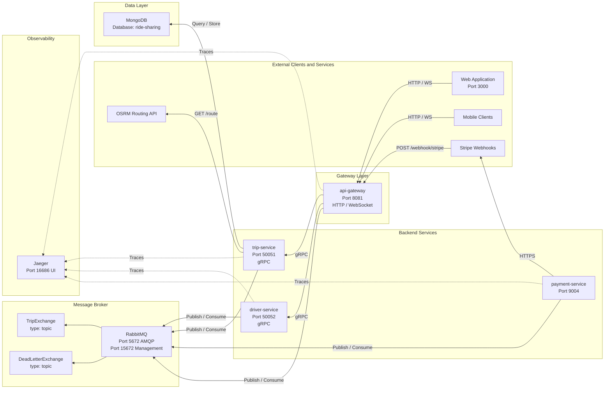
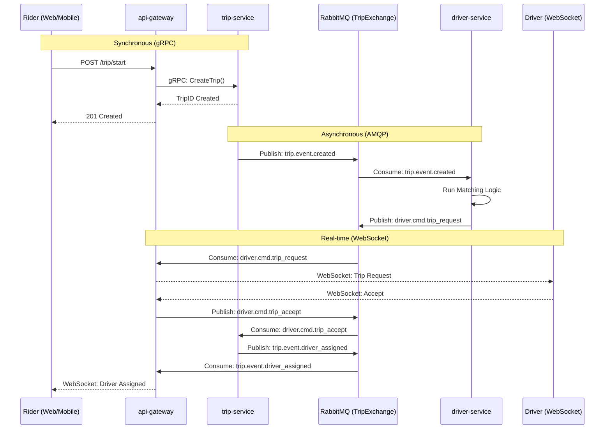

# RideSync — Cloud-Native Ride-Sharing Platform

A full-stack, event-driven ride-sharing platform built with Go microservices, gRPC, RabbitMQ, and Kubernetes. Covers the complete trip lifecycle — from fare preview and driver matching to real-time WebSocket updates and Stripe payment processing.

## Overview

RideSync models the core backend of a ride-sharing application (think Uber/Lyft) as a distributed system. Four independent microservices communicate via gRPC for synchronous calls and RabbitMQ for asynchronous events. A Next.js frontend connects riders and drivers in real time through WebSocket connections.

**What it does end-to-end:**

1. Rider requests a trip → fare and route previewed via OSRM routing API
2. Trip is created → `trip.event.created` published to RabbitMQ
3. Driver-service consumes the event → runs matching logic → notifies best available driver over WebSocket
4. Driver accepts → event chain updates trip status → rider gets notified in real time
5. Stripe webhook confirms payment → payment-service records the outcome

## Scalability & Engineering Decisions

RideSync is designed with production-scale constraints and distributed systems best practices in mind. The architecture reflects several core goals:

- **Stateless microservices** for horizontal scaling behind Kubernetes
- **Event-driven trip lifecycle** using RabbitMQ to avoid synchronous bottlenecks
- **Message retry policy** (up to 3 attempts) with Dead Letter Queue (DLQ) for failed event handling
- **Per-request gRPC communication** to prevent connection contention and cascading failures
- **Independent service scaling** (Trip, Driver, Payment) based on workload characteristics
- **Observability-first design** with distributed tracing for latency and failure analysis

Here is a closer look at how these goals are implemented in the code:

### 1. Synchronous + Asynchronous split

The rider gets an immediate HTTP 201 after `POST /trip/start`. Everything after that — matching, notification, confirmation — is asynchronous. This prevents the HTTP request from blocking on driver availability and makes each step independently retryable.

### 2. Event choreography over orchestration

No central orchestrator controls the trip flow. Each service reacts to events and emits its own, keeping services fully decoupled. Adding a new step (e.g., surge pricing, ETA updates) means subscribing a new consumer — no existing service changes.

### 3. Dead Letter Queue for resilience

The shared RabbitMQ client (`shared/messaging/`) applies a retry policy to every consumer: messages are nacked and requeued up to 3 times before being routed to `TripDLX`. This prevents poison messages from blocking the queue indefinitely.

### 4. Per-request gRPC clients

Each inbound HTTP request creates its own gRPC client connection to downstream services rather than sharing a long-lived connection. This prevents a slow or stuck service from holding resources that affect unrelated requests.

### 5. Protocol split — JSON external, Protobuf internal

External APIs use JSON (developer-friendly, easy to inspect). All inter-service gRPC calls use Protocol Buffers — strongly typed, compact, and faster to serialize than JSON.

### 6. Hexagonal architecture in Trip and Payment services

Domain logic has zero dependency on infrastructure. Swapping the MongoDB adapter for a different database, or the RabbitMQ publisher for a different broker, requires changing only the infrastructure layer.

---

## Architecture

### System Overview



### Trip Lifecycle — Event Flow

The trip lifecycle is fully choreographed through events. The rider gets an immediate HTTP response (201) while driver matching happens asynchronously in the background.



### Technology Stack

**Backend:**

| Concern           | Technology                       |
| ----------------- | -------------------------------- |
| Language          | Go 1.23                          |
| HTTP Router       | Gin                              |
| Inter-service RPC | gRPC + Protocol Buffers (proto3) |
| Async messaging   | RabbitMQ — AMQP via `amqp091-go` |
| Database          | MongoDB                          |
| Payment           | Stripe API (stripe-go v76)       |
| Real-time         | WebSocket (`gorilla/websocket`)  |
| Auth              | JWT (`golang-jwt/jwt v5`)        |
| Observability     | OpenTelemetry + Jaeger           |

**Infrastructure:**

| Concern             | Technology                                   |
| ------------------- | -------------------------------------------- |
| Containerization    | Docker (multi-stage builds, alpine runtime)  |
| Orchestration       | Kubernetes (Minikube / GKE)                  |
| Local dev           | Tilt (live reload + port-forward automation) |
| Distributed tracing | Jaeger (OpenTelemetry collector)             |

**Frontend:**

| Concern   | Technology                                    |
| --------- | --------------------------------------------- |
| Framework | Next.js 15 (App Router, React 19, TypeScript) |
| Styling   | Tailwind CSS                                  |
| Maps      | Leaflet / React-Leaflet                       |
| Real-time | WebSocket client                              |

---

## Services

### `api-gateway` (Port 8081)

The single entry point for all external traffic. Handles HTTP requests, manages WebSocket hubs for riders and drivers, bridges the RabbitMQ event bus to WebSocket clients, and proxies calls to internal gRPC services.

**HTTP API:**

| Method | Route             | Description                                       |
| ------ | ----------------- | ------------------------------------------------- |
| `POST` | `/trip/preview`   | Calculate route via OSRM and return fare estimate |
| `POST` | `/trip/start`     | Create a trip — delegates to trip-service gRPC    |
| `POST` | `/webhook/stripe` | Receive and validate Stripe payment events        |
| `WS`   | `/ws/riders`      | Persistent WebSocket connection for riders        |
| `WS`   | `/ws/drivers`     | Persistent WebSocket connection for drivers       |

**Event Bus (RabbitMQ):**

| Direction | Routing Key                  | Purpose                                                         |
| --------- | ---------------------------- | --------------------------------------------------------------- |
| Consume   | `driver.cmd.trip_request`    | Forward trip request to matched driver over WebSocket           |
| Consume   | `trip.event.driver_assigned` | Notify rider of confirmed driver assignment                     |
| Publish   | `driver.cmd.trip_accept`     | Forward driver's WebSocket acceptance back into the event chain |

---

### `trip-service` (Port 50051 — gRPC)

Owns the trip domain. Persists trips in MongoDB, calculates fares, and drives the event-based lifecycle.

**gRPC Methods:**

| Method             | Description                                              |
| ------------------ | -------------------------------------------------------- |
| `CreateTrip`       | Persists trip in MongoDB, publishes `trip.event.created` |
| `PreviewTrip`      | Calculates route (OSRM) and fare estimate — no DB write  |
| `UpdateTripStatus` | Updates trip status field                                |
| `GetTrip`          | Fetches trip by ID                                       |

**Event Bus (RabbitMQ):**

| Direction | Routing Key                  | Purpose                                             |
| --------- | ---------------------------- | --------------------------------------------------- |
| Publish   | `trip.event.created`         | Triggers driver matching after trip creation        |
| Consume   | `driver.cmd.trip_accept`     | Driver accepted — update status, publish assignment |
| Publish   | `trip.event.driver_assigned` | Broadcast final driver assignment to gateway        |

**MongoDB — `trips` collection:**
`trip_id`, `rider_id`, `origin`, `destination`, `status` (pending / active / completed / cancelled), `fare`, `driver_id`, `created_at`

**Architecture:** Hexagonal (domain / service / infrastructure layers)

---

### `driver-service` (Port 50052 — gRPC)

Manages driver state and availability. Runs the matching algorithm when a new trip event arrives.

**gRPC Methods:**

| Method                | Description                               |
| --------------------- | ----------------------------------------- |
| `UpdateDriverStatus`  | Toggle driver online / offline / busy     |
| `GetAvailableDrivers` | Query all drivers with status `available` |

**Event Bus (RabbitMQ):**

| Direction | Routing Key               | Queue                    | Purpose                                         |
| --------- | ------------------------- | ------------------------ | ----------------------------------------------- |
| Consume   | `trip.event.created`      | `find_available_drivers` | Run matching on new trip                        |
| Publish   | `driver.cmd.trip_request` | —                        | Send trip request to matched driver via gateway |

**MongoDB — `drivers` collection:**
`driver_id`, `name`, `status`, `location`, `current_trip_id`

---

### `payment-service` (Port 9004)

Handles Stripe payment intent creation and webhook-driven confirmation. Stores payment records in MongoDB.

**gRPC Methods:**

| Method                | Description                                   |
| --------------------- | --------------------------------------------- |
| `CreatePaymentIntent` | Creates a Stripe PaymentIntent for a trip     |
| `ConfirmPayment`      | Records confirmed payment from Stripe webhook |

**MongoDB — `payments` collection:**
`payment_id`, `trip_id`, `rider_id`, `amount`, `currency`, `status`, `stripe_intent_id`

**Architecture:** Hexagonal (domain / service / infrastructure layers)

---

## Shared Libraries (`shared/`)

| Package            | Contents                                                                                                                   |
| ------------------ | -------------------------------------------------------------------------------------------------------------------------- |
| `shared/messaging` | `NewRabbitMQ()`, `Publish()`, `Consume()` — wraps `amqp091-go`, manages `TripExchange` (topic) and `TripDLX`, retry policy |
| `shared/db`        | `NewMongoClient(uri)` — returns a configured `*mongo.Client`                                                               |
| `shared/types`     | Common structs: `Trip`, `Driver`, `Payment`, `Location`, `TripStatus`                                                      |

---

## Frontend (`web/`)

A Next.js 15 (App Router) frontend with two real-time dashboards.

| Page      | Description                                                             |
| --------- | ----------------------------------------------------------------------- |
| `/`       | Landing page                                                            |
| `/rider`  | Request a trip, see fare preview, receive live WebSocket status updates |
| `/driver` | See incoming trip requests, accept / reject, toggle availability        |
| `/map`    | Live map (Leaflet) showing rider and driver positions                   |

WebSocket connections point to `ws://api-gateway/ws/riders` and `ws://api-gateway/ws/drivers`.

---

## Quick Start

### Prerequisites

- Go 1.23+
- Docker
- kubectl
- Minikube
- Tilt

### Run Locally

```bash
# Start Minikube
minikube start

# Start all services with live reload
tilt up

# Open Tilt dashboard
open http://localhost:10350
```

Tilt automatically builds Docker images, applies Kubernetes manifests from `infra/development/`, and sets up port-forwards:

| Service             | Local Address            |
| ------------------- | ------------------------ |
| api-gateway         | `http://localhost:8081`  |
| RabbitMQ Management | `http://localhost:15672` |
| Jaeger UI           | `http://localhost:16686` |
| MongoDB             | `localhost:27017`        |

### Monitoring

```bash
# Pod status
kubectl get pods

# Kubernetes dashboard
minikube dashboard

# Distributed traces
open http://localhost:16686
```

---

## Infrastructure

### Development (`infra/development/`)

Kubernetes manifests for local Minikube:

- Deployments + ClusterIP Services for all 4 microservices, RabbitMQ (with management plugin), MongoDB, and Jaeger
- `secrets.yaml` — MongoDB URI, RabbitMQ URI, Stripe API keys, JWT secret

### Production (`infra/production/`)

GKE-ready configurations on top of the base manifests:

- CPU/memory resource requests and limits on all pods
- `HorizontalPodAutoscaler` for `api-gateway` and `trip-service`
- `PodDisruptionBudget` for availability guarantees
- `ConfigMap` for non-sensitive environment configuration

All service images are built with multi-stage Dockerfiles (`golang:1.23-alpine` builder → `alpine` runtime) to minimize final image size.

---

## Project Structure

```
RideSync/
├── services/
│   ├── api-gateway/          # HTTP/WebSocket edge — Gin, WebSocket hubs, event bridge
│   ├── trip-service/         # Trip lifecycle — gRPC server, MongoDB, event publisher
│   ├── driver-service/       # Driver state + matching — gRPC server, event consumer
│   └── payment-service/      # Stripe payments — gRPC server, webhook handler
│
├── web/                      # Next.js 15 frontend (rider + driver dashboards, live map)
│
├── proto/                    # Protobuf definitions (trip.proto, driver.proto, payment.proto)
│
├── shared/
│   ├── messaging/            # RabbitMQ client, TripExchange setup, retry/DLQ policy
│   ├── db/                   # MongoDB connection helper
│   └── types/                # Shared domain types (Trip, Driver, Payment, TripStatus)
│
├── infra/
│   ├── development/          # Minikube K8s manifests + secrets
│   └── production/           # GKE manifests with HPA, PDB, resource limits
│
├── Tiltfile                  # Local dev orchestration (build, deploy, port-forward)
├── go.mod
└── README.md
```

---

## What This Project Demonstrates

- **Distributed Systems Design** — Event-driven choreography, asynchronous decoupling, DLQ-backed resilience, retry policies
- **Microservices Architecture** — Service decomposition, independent deployability, per-service data ownership
- **gRPC & Protocol Buffers** — Strongly typed inter-service contracts with proto3, generated stubs
- **Real-time Systems** — WebSocket hub management bridged to an AMQP event bus
- **Clean / Hexagonal Architecture** — Domain isolation in trip-service and payment-service
- **Cloud-Native Engineering** — Multi-stage Docker builds, Kubernetes orchestration, HPA, PDB
- **Observability** — Distributed tracing across all services with OpenTelemetry and Jaeger
- **Payment Integration** — Stripe PaymentIntent lifecycle with webhook validation
- **Full-Stack Integration** — Go backend with a Next.js 15 / React 19 frontend communicating over REST and WebSocket


