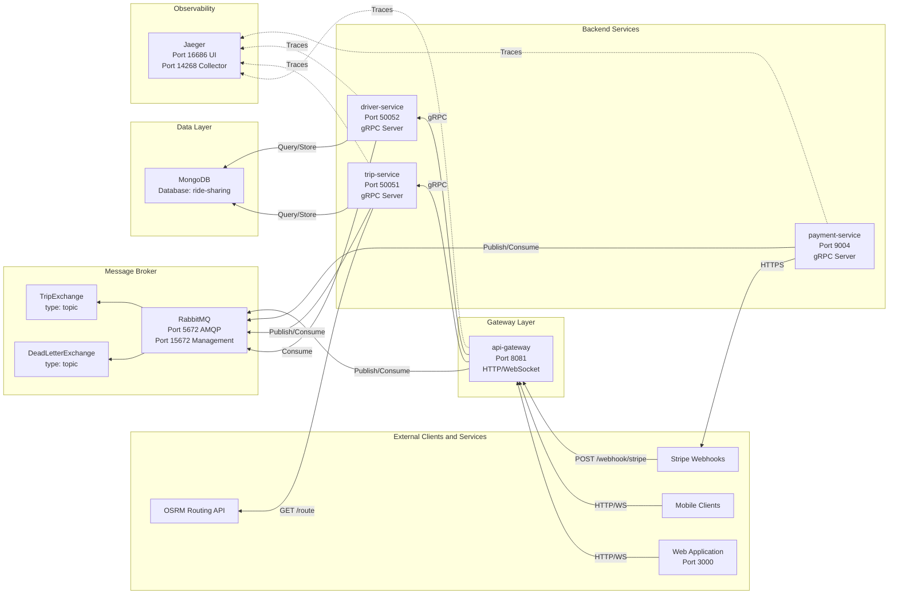

# RideSync - Cloud-Native Ride-Sharing Platform

A production-ready, horizontally scalable ride-sharing backend built with microservices architecture using Go, gRPC, and Kubernetes. Designed to handle real-time trip matching, dynamic pricing, and payment processing at scale.

## 🎯 Overview

RideSync is a complete backend system for a ride-sharing application (similar to Uber/Lyft) that demonstrates enterprise-grade software engineering practices. The system handles trip requests, driver matching, real-time location tracking, fare calculation, and payment processing through a distributed microservices architecture.

**Key Capabilities:**

- Real-time trip preview with route calculation and fare estimation
- Live driver-rider matching via WebSocket connections
- Event-driven architecture for asynchronous operations
- Distributed tracing across all services
- Payment processing with Stripe integration
- Containerized deployment with Kubernetes orchestration

## 📈 Scalability & Design Goals

RideSync is designed with production-scale constraints and distributed systems best practices:

- Stateless microservices for horizontal scaling behind Kubernetes
- Event-driven trip lifecycle using RabbitMQ to avoid synchronous bottlenecks
- Message retry policy (up to 3 attempts) with Dead Letter Queue (DLQ) for failed event handling
- Per-request gRPC communication to prevent connection contention and cascading failures
- Independent service scaling (Trip, Driver, Payment) based on workload characteristics
- Observability-first design with distributed tracing for latency and failure analysis

## 🏗️ Architecture

### System Design

The platform consists of four microservices (API Gateway, Trip, Driver, and Payment) communicating via gRPC and RabbitMQ:



### Technology Stack

Backend Services:

- **Language:** Go
- **Service Communication:** gRPC with Protocol Buffers
- **Async Messaging:** RabbitMQ (AMQP)
- **Database:** MongoDB
- **Payment Integration:** Stripe API

Infrastructure:

- **Containerization:** Docker
- **Orchestration:** Kubernetes (Minikube for local, GKE for production)
- **Development Workflow:** Tilt (live reload)
- **Observability:** Jaeger (OpenTelemetry distributed tracing)

Frontend:

- **Framework:** Next.js 15 (React 19)
- **Styling:** Tailwind CSS
- **Maps:** Leaflet/React-Leaflet
- **Real-time:** WebSocket client

### Microservices Architecture Highlights

**Clean Architecture Implementation:**
Each service follows hexagonal architecture principles with clear separation of concerns:

- **Domain Layer:** Business logic and interfaces (port definitions)
- **Service Layer:** Use case implementations
- **Infrastructure Layer:** External adapters (gRPC, repositories, event handlers)

**Communication Protocols:**

- **HTTP REST:** External client requests (JSON)
- **WebSocket:** Real-time bidirectional communication
- **gRPC:** High-performance inter-service calls (Protocol Buffers)

## 🚀 Quick Start

### Prerequisites

- Docker
- Go 1.23+
- Tilt
- Kubernetes cluster (Minikube)
- kubectl

### Running Locally

```
# Clone the repository
git clone https://github.com/RushikeshBhavsar3605/RideSync.git
cd RideSync

# Start all services with hot reload
tilt up

# Access the Tilt UI
# Open http://localhost:10350 in your browser
```

### Monitoring

```
# View running pods
kubectl get pods

# Access Kubernetes dashboard
minikube dashboard

# View distributed traces
# Jaeger UI: http://localhost:16686
```

## 📡 API Endpoints

**Trip Management:**

- `POST /trip/preview` - Calculate route and fare estimates
- `POST /trip/start` - Create a new trip

**Real-time Communication:**

- `WS /ws/riders` - Rider WebSocket connection
- `WS /ws/drivers` - Driver WebSocket connection

**Webhooks:**

- `POST /webhook/stripe` - Stripe payment webhooks

## 🔧 Key Engineering Practices

**1. Distributed Tracing**

Full request tracing across all services using OpenTelemetry and Jaeger for debugging and performance monitoring.

**2. Event-Driven Architecture**

Asynchronous communication via RabbitMQ for decoupled services and improved resilience.

**3. Resilience Patterns**

Per-request gRPC client pattern prevents cascading failures between services.

**4. Protocol Optimization**

- JSON for external APIs (developer-friendly)
- Protocol Buffers for internal communication (performance)

**5. Infrastructure as Code**

Complete Kubernetes manifests for development and production environments.

## 🌐 Production Deployment

The project includes complete deployment configurations for Google Cloud Platform (GKE):

- Multi-stage Docker builds for optimized images
- Kubernetes manifests with health checks and resource limits
- Horizontal pod autoscaling
- Managed SSL certificates
- Secret management

## 📁 Project Structure

```
RideSync/
├── services/                 # Microservices
│   ├── api-gateway/          # HTTP/WebSocket edge service
│   ├── trip-service/         # Trip lifecycle & matching logic
│   ├── driver-service/       # Driver state & availability
│   └── payment-service/      # Payment processing
│
├── web/                      # Next.js frontend
│
├── proto/                    # gRPC service definitions
│
├── shared/                   # Shared libraries
│   ├── db/                   # MongoDB connection
│   ├── messaging/            # RabbitMQ client & utilities
│   └── types/                # Common models & helpers
│
├── infra/                    # Infrastructure configs
│   ├── development/          # Local Docker + Kubernetes manifests
│   └── production/           # Production Kubernetes configs
│
├── Tiltfile                  # Local dev orchestration (live reload)
├── go.mod                    # Go module
└── README.md
```

## 🧠 What This Project Demonstrates

This project demonstrates proficiency in:

- **Microservices Architecture:** Service decomposition, API design, inter-service communication
- **Cloud-Native Development:** Containerization, orchestration, 12-factor app principles
- **Distributed Systems:** Event-driven architecture, distributed tracing, resilience patterns
- **Backend Engineering:** Go programming, gRPC, Protocol Buffers, WebSocket
- **DevOps:** Docker, Kubernetes, CI/CD-ready infrastructure, observability
- **Full-Stack Integration:** Frontend-backend integration, real-time communication
