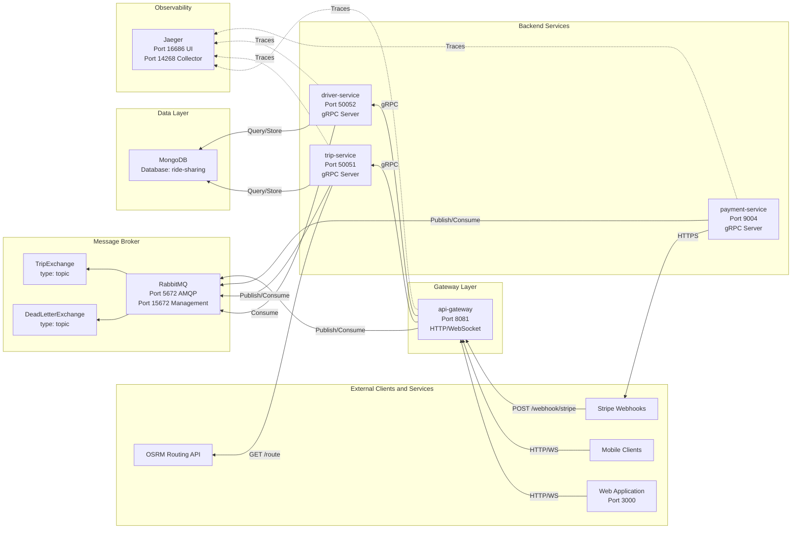

```mermaid
flowchart RL
    %% Subgraph Definitions
    subgraph External [External Clients and Services]
        direction TB
        Stripe[Stripe Webhooks]
        Mobile[Mobile Clients]
        Web[Web Application<br/>Port 3000]
        OSRM[OSRM Routing API]
    end

    subgraph Gateway [Gateway Layer]
        APIGW[api-gateway<br/>Port 8081<br/>HTTP/WebSocket]
    end

    subgraph Backend [Backend Services]
        Payment[payment-service<br/>Port 9004<br/>gRPC Server]
        Driver[driver-service<br/>Port 50052<br/>gRPC Server]
        Trip[trip-service<br/>Port 50051<br/>gRPC Server]
    end

    subgraph Broker [Message Broker]
        direction TB
        Rabbit[RabbitMQ<br/>Port 5672 AMQP<br/>Port 15672 Management]
        TripEx[TripExchange<br/>type: topic]
        DLX[DeadLetterExchange<br/>type: topic]
    end

    subgraph Data [Data Layer]
        Mongo[MongoDB<br/>Database: ride-sharing]
    end

    subgraph Obs [Observability]
        Jaeger[Jaeger<br/>Port 16686 UI<br/>Port 14268 Collector]
    end

    %% --- Relationships ---

    %% External to Gateway
    Stripe -->|POST /webhook/stripe| APIGW
    Mobile -->|HTTP/WS| APIGW
    Web -->|HTTP/WS| APIGW

    %% Gateway to Backend
    APIGW -->|gRPC| Driver
    APIGW -->|gRPC| Trip

    %% Backend Service Inter-connections & Outbound
    Payment -->|HTTPS| Stripe
    Trip -->|GET /route| OSRM

    %% Database Connections
    Driver -->|Query/Store| Mongo
    Trip -->|Query/Store| Mongo

    %% Message Broker Connections
    APIGW -->|Publish/Consume| Rabbit
    Payment -->|Publish/Consume| Rabbit
    Trip -->|Publish/Consume| Rabbit
    Driver -->|Consume| Rabbit

    %% Broker Internal Exchanges
    Rabbit --> TripEx
    Rabbit --> DLX

    %% Observability (Traces)
    %% Using dotted lines
    Payment -.->|Traces| Jaeger
    Driver -.->|Traces| Jaeger
    Trip -.->|Traces| Jaeger
    APIGW -.->|Traces| Jaeger
```
